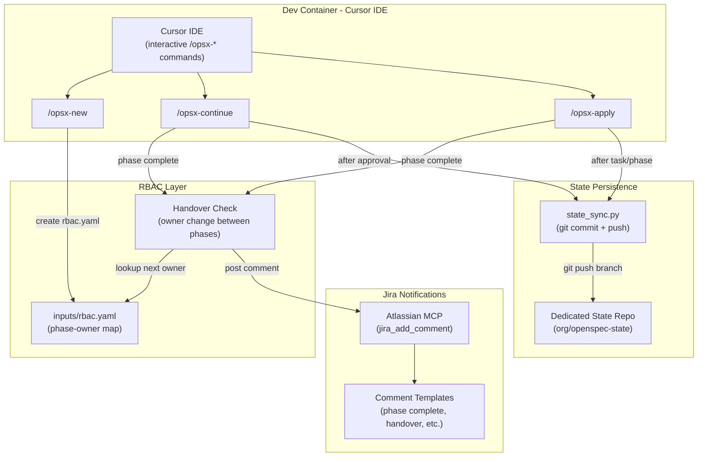
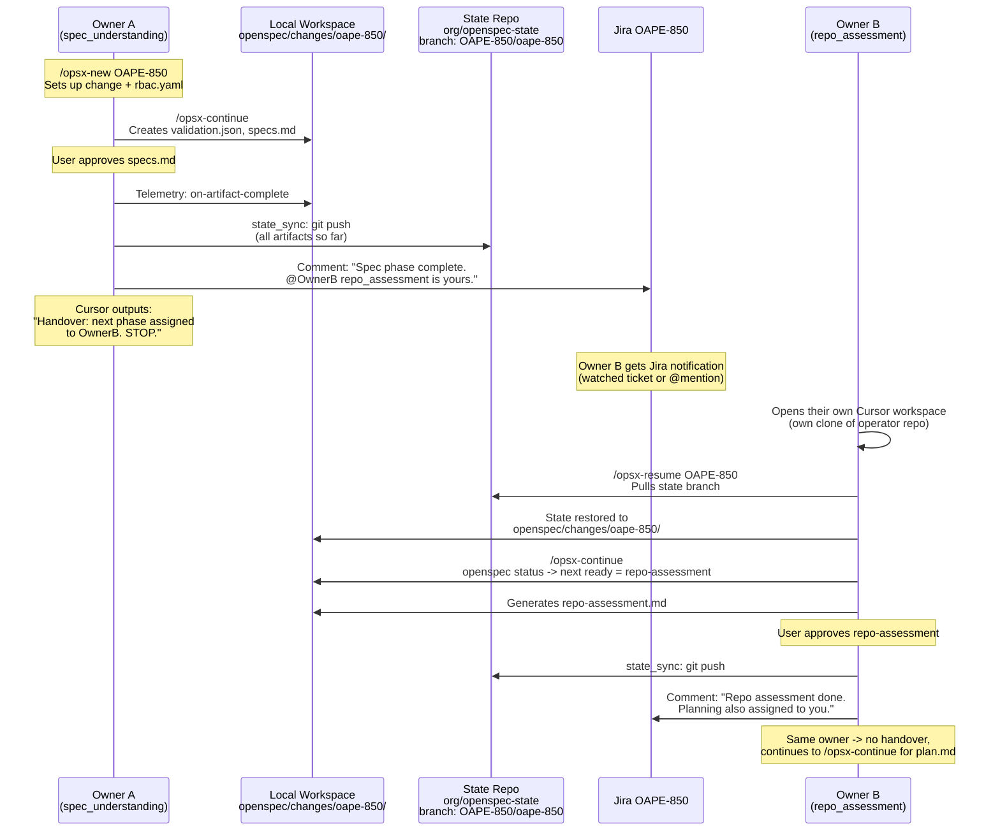

# OpenSpec Containerized Workspace with RBAC Phase Ownership and Jira Notifications

## Decisions (Confirmed)

| Decision | Choice |
|----------|--------|
| Trigger mechanism | Existing `/opsx-*` Cursor commands, used interactively in Cursor IDE |
| Container approach | **Dev container** -- Cursor workspace runs inside a containerized environment |
| State upload target | **Dedicated state repo** (e.g. `org/openspec-state`) with one branch per workflow run |
| Notification method | **Jira comments + @mentions** on the child ticket (not email) |
| Handover behavior | Notify next owner via Jira comment; current user sees "handover pending" message in Cursor |
| Owner workspace | Each owner has their own clone of the operator repo with openspec installed |
| State bootstrap | Next owner pulls state from the state repo branch (via `/opsx-resume` command) |

## Architecture Overview



The key insight: **no headless runner or phase engine is needed**. The existing Cursor commands remain the orchestration layer. We add three capabilities on top:
1. The workspace runs in a dev container (reproducible environment)
2. After each phase, artifacts are committed and pushed to a state repo
3. After each phase, a Jira comment is posted notifying the relevant owner

---

## Part 1: Dev Container Setup

### 1.1 Create Dev Container Configuration

Create [`.devcontainer/devcontainer.json`](.devcontainer/devcontainer.json) -- standard VS Code / Cursor dev container config:

```json
{
  "name": "OpenSpec Agile Workflow",
  "build": {
    "dockerfile": "Containerfile",
    "context": ".."
  },
  "features": {
    "ghcr.io/devcontainers/features/node:1": { "version": "20" },
    "ghcr.io/devcontainers/features/python:1": { "version": "3.12" },
    "ghcr.io/devcontainers/features/git:1": {},
    "ghcr.io/devcontainers/features/github-cli:1": {}
  },
  "postCreateCommand": "pip install -r openspec/telemetry/requirements.txt && npm install -g @fission-ai/openspec",
  "remoteEnv": {
    "OPENSPEC_STATE_REPO": "${localEnv:OPENSPEC_STATE_REPO}",
    "GIT_TOKEN": "${localEnv:GIT_TOKEN}"
  },
  "customizations": {
    "vscode": {
      "extensions": ["cursor.cursor"]
    }
  }
}
```

### 1.2 Create Containerfile

Create [`.devcontainer/Containerfile`](.devcontainer/Containerfile):

- Base: `mcr.microsoft.com/devcontainers/base:ubuntu` (standard dev container base)
- Pre-install: Python 3.12, Node 20, git, gh CLI, Go (for operator work), make
- Pre-install: openspec CLI, telemetry deps, dashboard deps
- Configure git credential helper for state repo push
- The workspace is mounted by Cursor automatically (not baked into the image)

### 1.3 Environment Variables

Create [`.devcontainer/.env.example`](.devcontainer/.env.example):

```bash
# State repo for artifact persistence (Part 2)
OPENSPEC_STATE_REPO=https://github.com/org/openspec-state.git
GIT_TOKEN=ghp_...

# Jira (for notifications via MCP - Part 4)
# Jira MCP auth is handled by Cursor MCP settings, not env vars
```

---

## Part 2: Stateful Content Upload to Dedicated Git Repo

### 2.1 State Sync Module

Create [`openspec/state_sync.py`](openspec/state_sync.py):

```python
def sync_state(change: str, phase_name: str, jira_key: str) -> str:
    """Commit and push change artifacts to the state repo.
    
    Returns the commit SHA.
    """
```

**Behavior:**
- Clone or reuse a local checkout of `OPENSPEC_STATE_REPO` (env var) into a temp/cache dir (e.g. `/tmp/openspec-state-cache/`)
- Branch naming: `<jira-key>/<change-slug>` (e.g. `OAPE-850/trust-manager`)
- Create branch from `main` on first push; subsequent pushes to the same branch
- Copy all files from `openspec/changes/<change>/` into the branch working tree
- Commit with message: `[openspec] <phase_name> complete - <jira_key>`
- Push to remote
- Return the commit SHA for recording in `state.yaml`
- On failure: log warning but do not block the workflow (state sync is best-effort)

**Files synced per phase:**
- `inputs/` (jira.yaml, jira-spec.md, rbac.yaml, agents.md, constitution.md)
- `validation.json`, `specs.md`, `repo-assessment.md`, `plan.md`, `tasks.md`
- `eval-results/` (eval scoring artifacts)
- `telemetry/events.jsonl` and `telemetry/metrics-report.json`
- `implementation/state.yaml`, `implementation/task-reports/`
- `implementation-report.md`, `deviation-observed.md` (if present)

### 2.2 Hook Into Telemetry Auto

Modify [`openspec/telemetry/auto.py`](openspec/telemetry/auto.py) to call `state_sync.sync_state()` at these existing hook points:

| Hook | When | Trigger |
|------|------|---------|
| `on-artifact-complete` | Phase 1-4 artifact approved by user | `/opsx-continue` step 11 |
| `on-task-complete` | Each implementation task approved | `/opsx-apply` step 5 (on approve) |
| `on-phase-complete` | All tasks in a plan phase done | `/opsx-apply` step 6 |
| `on-apply-complete` | All phases done, implementation finished | `/opsx-apply` step 6 (final) |

The sync call is appended to the existing telemetry hook -- it runs **after** the telemetry event is written but **before** the command yields back to the user.

### 2.3 State Repo Configuration

Add to [`openspec/config.yaml`](openspec/config.yaml):

```yaml
state_sync:
  enabled: true
  repo_env_var: OPENSPEC_STATE_REPO   # env var containing the repo URL
  token_env_var: GIT_TOKEN            # env var containing the auth token
  branch_pattern: "{jira_key}/{change_slug}"
  sync_on:
    - artifact_complete
    - task_complete
    - phase_complete
```

---

## Part 3: RBAC Phase Ownership

### 3.1 RBAC Configuration Schema

Instance configs stored per-change at `openspec/changes/<change>/inputs/rbac.yaml`:

```yaml
epic_owner: epic-owner@redhat.com
phase_owners:
  spec_understanding:
    owner: x@redhat.com
    display_name: "Spec Validator"
  repo_assessment:
    owner: Y@redhat.com
    display_name: "Repo Assessor"
  arch_planning:
    owner: Y@redhat.com
    display_name: "Planner"
  subtask_creation:
    owner: a@redhat.com
    display_name: "Task Creator"
  code_generation:
    owner: b@redhat.com
    display_name: "Code Generator"
```

### 3.2 RBAC Module

Create [`openspec/rbac.py`](openspec/rbac.py):

- `load_rbac_config(change_dir: Path) -> RBACConfig` -- load and validate from `inputs/rbac.yaml`
- `get_phase_owner(config, phase_name: str) -> PhaseOwner` -- return owner for a phase
- `get_next_phase_owner(config, current_phase: str) -> PhaseOwner | None` -- return the next phase's owner
- `is_handover_needed(config, current_phase: str) -> bool` -- true if current and next phase have different owners
- `validate_rbac_config(config) -> list[str]` -- return validation errors (missing phases, invalid emails)

### 3.3 Update /opsx-new Command

Modify [`.cursor/commands/opsx-new.md`](.cursor/commands/opsx-new.md) to add a step after Jira metadata fetch:

**New step 4b (after step 4, before step 5) -- state repo setup:**

> 4a. **State repo auto-creation** (if `state_sync.enabled` in config.yaml):
>   - Read `OPENSPEC_STATE_REPO` env var. If set, verify the repo exists via GitHub MCP `get_file_contents` or similar.
>   - If env var is empty or repo does not exist:
>     - Derive org from `target_repo` URL if available, otherwise ask user for org name.
>     - Call GitHub MCP `create_repository` with name `openspec-state`, org, private=true.
>     - Set `OPENSPEC_STATE_REPO` in the environment and persist to `inputs/jira.yaml` as `state_repo_url`.
>   - Create the branch `<jira-key>/<change-slug>` with an initial commit containing `inputs/jira.yaml`.

**New step 4b (RBAC configuration):**

> 4b. **RBAC configuration** (optional):
>   - If the Epic has RBAC owner assignments (parsed from Epic description or custom fields),
>     write `inputs/rbac.yaml` with the phase-owner mapping.
>   - Otherwise, ask the user:
>     "Define phase owners for this change? (Enter email addresses or skip)"
>     - Spec validation owner: [email or skip]
>     - Repo assessment owner: [email or skip]
>     - Planning owner: [email or skip]
>     - Tasks owner: [email or skip]
>     - Code generation owner: [email or skip]
>   - If all skipped: do not create `rbac.yaml` (single-owner mode, no handover).
>   - If provided: write `inputs/rbac.yaml` and confirm.

### 3.4 Handover Logic in /opsx-continue

Modify [`.cursor/commands/opsx-continue.md`](.cursor/commands/opsx-continue.md) to add handover check after user approval (step 11):

**New step 12 (after telemetry signal in step 11):**

> 12. **Handover check** (only if `inputs/rbac.yaml` exists):
>   - Load RBAC config.
>   - Determine the completed phase and the next phase.
>   - If `is_handover_needed()` (different owner for next phase):
>     a. Resolve next owner's Jira `accountId` via `jira_search_users(query="<email>")` (cache in rbac.yaml).
>     b. Post Jira comment on child ticket with `[~accountid:<id>]` mention (see Part 4).
>     c. Push state to state repo (Part 2).
>     d. Output to current user:
>        ```
>        HANDOVER: <current_phase> is complete.
>        Next phase (<next_phase>) is assigned to <next_owner>.
>        A Jira notification has been posted on <JIRA_KEY>.
>        The assigned owner must run /opsx-resume <JIRA_KEY> then /opsx-continue.
>        ```
>     e. **HARD STOP** -- refuse to generate the next artifact. This is not a warning; the command will not proceed regardless of user input.
>   - If same owner: proceed normally (no handover message).

### 3.5 Handover Logic in /opsx-apply

Modify [`.cursor/commands/opsx-apply.md`](.cursor/commands/opsx-apply.md) step 6 (phase boundary):

After "All Phase {N} tasks complete" and optional PR:

> 6b. **Handover check** (only if `inputs/rbac.yaml` exists):
>   - If next phase has a different owner:
>     a. Post Jira comment notifying next owner.
>     b. Push state to state repo.
>     c. Output: "Phase {N} complete. Next phase assigned to <next_owner>. Jira notification posted."
>     d. Set state: `IDLE` (not `PHASE_COMPLETE` for task gen).
>   - Inform next owner to run `/opsx-continue` for task generation.

### 3.6 The /opsx-resume Command (How the Next Owner Continues)

Create a new Cursor command [`.cursor/commands/opsx-resume.md`](.cursor/commands/opsx-resume.md):

**Purpose:** When Owner B gets the Jira notification that it's their turn, they run `/opsx-resume <JIRA-KEY>` in their own Cursor workspace. This pulls the state from the dedicated state repo and reconstructs the local `openspec/changes/<change>/` directory so `/opsx-continue` can pick up where Owner A left off.

**Command syntax:**
```
/opsx-resume OAPE-850
/opsx-resume OAPE-850 my-change-name
```

**Steps:**
1. Parse Jira key (required), optional change name.
2. Read `OPENSPEC_STATE_REPO` from env (or `openspec/config.yaml` -> `state_sync.repo_env_var`).
3. List remote branches matching `<jira-key>/*` in the state repo.
   - If one match: use it.
   - If multiple: present choices to user.
   - If none: error -- "No state found for this Jira key."
4. Clone/fetch the state branch into a temp dir.
5. **Divergence check**: If `openspec/changes/<change>/` already exists locally:
   - Compare local state with remote state (diff file list + timestamps).
   - If diverged, ASK: "Local state diverges from state repo. Overwrite local with remote? (Yes / No / Show diff)"
   - On "No": abort resume.
   - On "Show diff": display file-level diff summary, then re-ask.
   - On "Yes": back up local to `openspec/changes/<change>.backup-<timestamp>/`, then overwrite.
   - If local does not exist: proceed directly (no conflict possible).
6. Copy contents into `openspec/changes/<change>/` in the local workspace.
7. Run `openspec status --change "<change>" --json` to verify state is valid.
8. Load `inputs/rbac.yaml` and verify current user is the assigned owner for the next phase.
9. Display summary:
   ```
   Resumed change: <change-name>
   Jira: <jira-key>
   Last completed phase: <phase_name> (by <previous_owner>)
   Next phase: <next_phase_name> (assigned to you)
   
   Run /opsx-continue to start the next phase.
   ```
10. **STOP** -- do not auto-start the next phase.

### 3.7 End-to-End Handover Flow

Here is the complete lifecycle when phases have different owners:



**Key points:**
- Each owner works in **their own Cursor IDE** with their own clone of the operator repo
- `/opsx-resume` is the bridge -- it pulls the shared state into the new owner's workspace
- The state repo branch is the single source of truth that travels between owners
- `openspec status` (existing command) correctly identifies the next ready artifact because all prior artifacts exist on disk after resume
- If the same owner handles consecutive phases, no handover happens -- they just keep running `/opsx-continue`

---

## Part 4: Jira Comment Notifications (replaces email)

### 4.1 Jira Notification Module

Create [`openspec/jira_notify.py`](openspec/jira_notify.py):

This module provides **comment text templates** that the Cursor commands use with the Atlassian MCP `jira_add_comment` tool. It does NOT call Jira directly -- it formats the comment body and the Cursor command invokes the MCP.

Functions:
- `format_phase_complete_comment(phase_name, status, quality_score, artifacts, next_owner)` -> str
- `format_handover_comment(completed_phase, next_phase, next_owner_email, artifacts_branch)` -> str
- `format_run_complete_comment(jira_key, phases_summary, state_repo_branch)` -> str
- `format_phase_failed_comment(phase_name, error_summary, assigned_owner)` -> str

### 4.2 Comment Templates

**Phase Complete (no handover):**
```
[OpenSpec] Phase "{phase_name}" completed successfully.

Status: {status} | Quality: {quality_score}% | Iterations: {iteration_count}
Artifacts: {artifact_list}
State branch: {state_repo_branch}

Phase owner: @{owner_mention}
```

**Handover Notification:**
```
[OpenSpec] Phase handover: "{completed_phase}" -> "{next_phase}"

"{completed_phase}" has been completed by @{current_owner}.
The next phase "{next_phase}" is assigned to @{next_owner}.

Action required: @{next_owner} please run /opsx-continue in the dev container to proceed.

Artifacts from completed phase:
- {artifact_list}
State branch: {state_repo_url}/tree/{branch}
```

**Run Complete:**
```
[OpenSpec] All phases complete for {jira_key}.

Summary:
{phases_table}

All artifacts available at: {state_repo_url}/tree/{branch}
```

### 4.3 Integration into Cursor Commands

The Cursor commands (`/opsx-continue`, `/opsx-apply`) will call the Atlassian MCP directly after formatting the comment:

```
# In /opsx-continue step 12 (handover):
1. Format comment using openspec/jira_notify.py template
2. Call Atlassian MCP: jira_add_comment(issue_key=<JIRA_KEY>, body=<formatted_comment>)
```

Since Red Hat uses **Jira Cloud** (`redhat.atlassian.net`), mentions use [Atlassian account IDs](https://developer.atlassian.com/cloud/jira/platform/apis/document/nodes/mention/). The flow:
1. RBAC config stores email addresses (e.g. `x@redhat.com`)
2. On first notification for an owner, call `jira_search_users(query="x@redhat.com")` via Atlassian MCP to resolve their `accountId`
3. Cache the `accountId` in `inputs/rbac.yaml` (avoid repeated lookups)
4. Format mention in comment body as `[~accountid:<id>]` (Jira Cloud shorthand that triggers email notification to the mentioned user)

### 4.4 Notification Points

| Event | Who is notified | Where |
|-------|----------------|-------|
| Phase starts | Phase owner (if RBAC configured) | Jira comment on child ticket |
| Phase complete (same owner continues) | Current owner (informational) | Jira comment on child ticket |
| Phase complete (handover needed) | Next phase owner (@mentioned) | Jira comment on child ticket |
| Phase failed | Phase owner + Epic owner | Jira comment on child ticket |
| All phases complete | Epic owner | Jira comment on child ticket |

---

## File Changes Summary

| Category | New Files | Modified Files |
|----------|-----------|----------------|
| Dev Container | `.devcontainer/devcontainer.json`, `.devcontainer/Containerfile`, `.devcontainer/.env.example` | -- |
| State Sync | `openspec/state_sync.py` | `openspec/telemetry/auto.py`, `openspec/config.yaml` |
| Resume | `.cursor/commands/opsx-resume.md` | -- |
| RBAC | `openspec/rbac.py` | `.cursor/commands/opsx-new.md` |
| Jira Notify | `openspec/jira_notify.py` | `.cursor/commands/opsx-continue.md`, `.cursor/commands/opsx-apply.md` |
| Handover | -- (logic in rbac.py + command updates) | `.cursor/commands/opsx-continue.md`, `.cursor/commands/opsx-apply.md` |
| Dashboard | -- | `dashboard/src/models/phase.py` (add owner field) |

**Total: 7 new files, 6 modified files.**

---

## Resolved Decisions (formerly Open Questions)

1. **State repo creation**: `/opsx-new` auto-creates the state repo via GitHub MCP (`create_repository`) if it does not already exist. The repo name defaults to `openspec-state` under the org derived from the target repo URL.

2. **Jira @mentions**: Red Hat uses **Jira Cloud** (`redhat.atlassian.net`), so mentions use [Atlassian Document Format (ADF)](https://developer.atlassian.com/cloud/jira/platform/apis/document/nodes/mention/) with account IDs. The flow is:
   - RBAC config stores email addresses (e.g. `x@redhat.com`)
   - At notification time, call Atlassian MCP `jira_search_users` (or equivalent) with `query: "<email>"` to resolve the Atlassian `accountId`
   - Format mention as `[~accountid:<resolved_id>]` in the comment body (plain-text shorthand that Jira Cloud renders as a clickable mention with email notification)
   - Cache resolved account IDs in `inputs/rbac.yaml` under `jira_account_id` per owner to avoid repeated lookups

3. **Handover blocking**: **Hard-refuse**. When `/opsx-continue` detects that the next phase is assigned to a different owner (via `inputs/rbac.yaml`), it:
   - Pushes state to the state repo
   - Posts the Jira handover comment
   - Outputs the handover message
   - **Refuses to generate the next artifact** -- the current user cannot override
   - The assigned owner must run `/opsx-resume` + `/opsx-continue` in their own workspace

4. **Conflict resolution**: `/opsx-resume` **warns about divergence**. If the local `openspec/changes/<change>/` already exists and the state branch has newer commits, it shows a diff summary and asks the user: "Local state diverges from state repo. Overwrite local with remote? (Yes / No / Show diff)"
