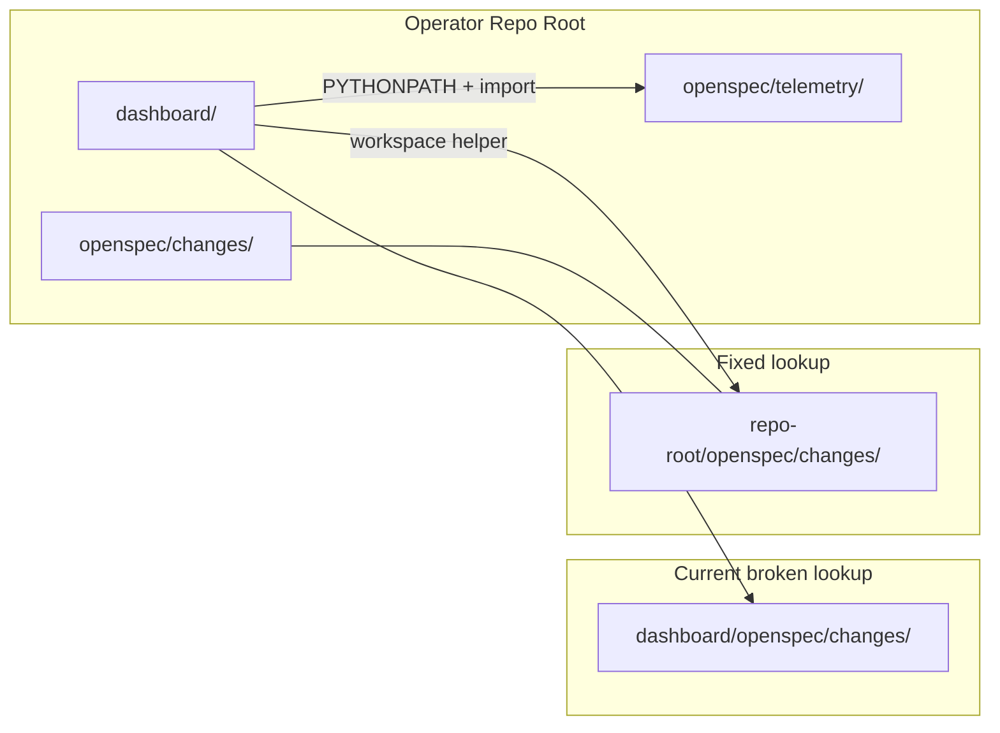
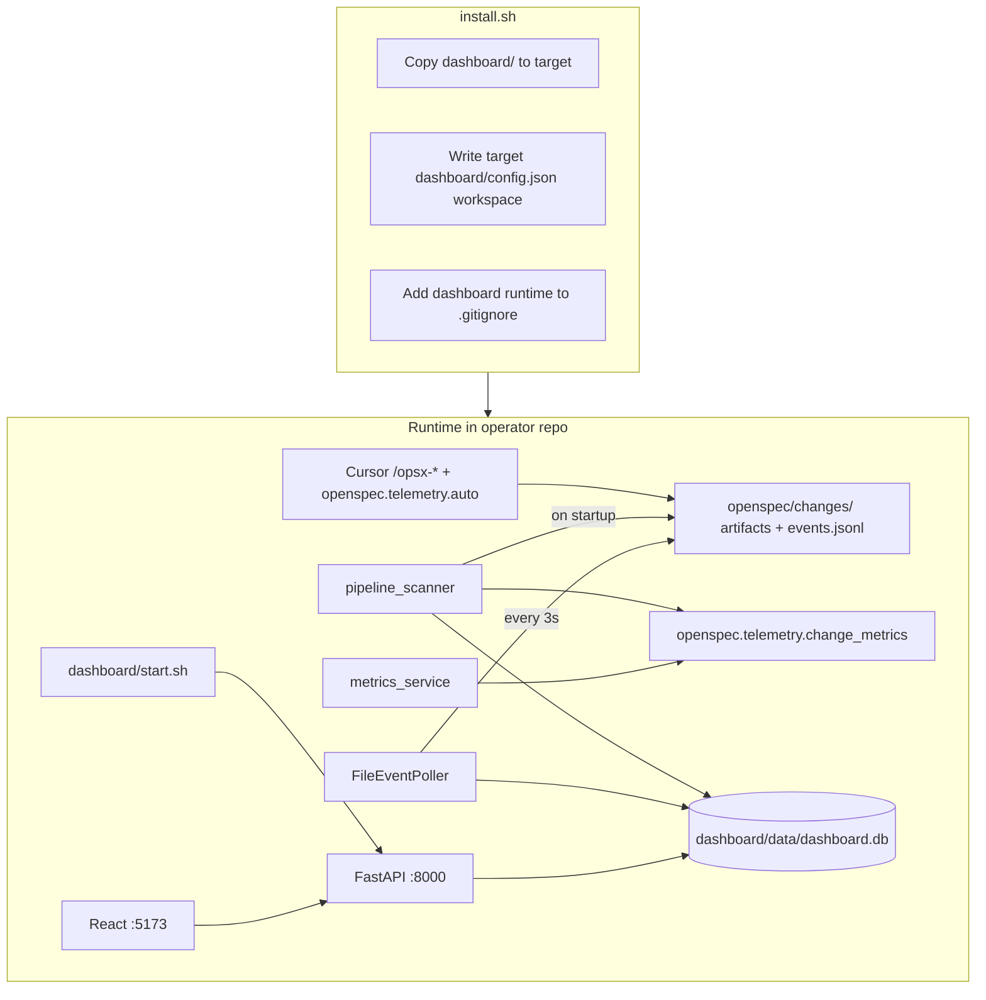

# Option A: Dashboard Installed in Operator Workspace

## Goal

After running `install.sh /path/to/operator-repo`, the operator repo becomes self-contained:

```
operator-repo/
├── openspec/           # workflow + openspec/telemetry/ (already copied today)
├── .cursor/            # /opsx-* commands (already copied today)
├── eval-generation/    # optional eval loop (already copied today)
└── dashboard/          # NEW — copied by default
    ├── start.sh
    ├── config.json
    ├── src/            # FastAPI backend (ingest + UI only — no emitter package)
    └── web/            # React frontend
```

User starts the dashboard from their repo:

```bash
cd /path/to/operator-repo
./dashboard/start.sh
```

No `/tmp/openspec-workflow` dependency. Dashboard remains **optional to run**; workflow works without it.

**User choices confirmed:**
- Copy `dashboard/` by default; add `--no-dashboard` to skip
- Do **not** copy `bin/opsx` — dashboard ingests data via disk scan + `FileEventPoller` only
- **Only telemetry change vs original Option A:** use [`openspec/openspec/telemetry/`](openspec/openspec/telemetry/) — do **not** maintain or path-fix `dashboard/src/telemetry/`

---

## Delta from original Option A (telemetry)

Original Option A assumed updating `dashboard/src/telemetry/{client,auto,cli,openspec_wrapper}.py` with workspace helpers.

**Current state:** those files are **gone** (empty stub removed). Emission already lives in `openspec.telemetry` and is hooked from `/opsx-*` commands.

| Original Option A | This plan |
|-------------------|-----------|
| Path-fix `dashboard/src/telemetry/*.py` | **Do not recreate** dashboard emitter |
| Manual `python -m src.telemetry.auto` | Use `python -m openspec.telemetry.auto` |
| Local `src.services.change_metrics` | Import `openspec.telemetry.change_metrics` |
| — | Export `PYTHONPATH=$OPSX_WORKSPACE` so `openspec.telemetry` imports resolve |

Keep dashboard-only ingest: `FileEventPoller`, `telemetry_service` (HTTP→DB+SSE), `report_service` (DB run report). These are **not** the openspec emitter.

---

## Why copying alone is not enough

Today, Python code resolves paths relative to the **dashboard working directory**:

```python
CHANGES_DIR = Path("openspec/changes")  # → dashboard/openspec/changes (WRONG)
```

With Option A layout, real data lives at **`{repo-root}/openspec/changes`**, one level up from `dashboard/`. Copying files without fixing paths will still produce an empty dashboard.



**Required companion work:** workspace path resolver + rewire metrics imports to `openspec.telemetry`.

---

## Architecture after fix



Live phase/task events come from `/opsx-*` hooks calling `python -m openspec.telemetry.auto ...`, which writes `events.jsonl`. Dashboard also gets:
- `pipeline_scanner` reading `eval-results/*.yaml` on backend startup
- `FileEventPoller` ingesting `telemetry/events.jsonl`

---

## Implementation plan

### 1. Add workspace path resolution

**New file:** [`dashboard/src/core/paths.py`](dashboard/src/core/paths.py)

```python
def get_workspace(cfg: AppConfig) -> Path:
    # Priority: OPSX_WORKSPACE env > config.workspace (if not ${...}) > parent of dashboard/

def get_changes_dir(cfg: AppConfig) -> Path:
    # workspace / cfg.openspec.changes_dir (relative segments joined to workspace)

def get_change_dir(cfg: AppConfig, change: str) -> Path:
    return get_changes_dir(cfg) / change
```

Resolution rules:
1. `OPSX_WORKSPACE` env var (set by [`dashboard/start.sh`](dashboard/start.sh))
2. `config.json` `"workspace"` if set to a real absolute path
3. Default: parent of `dashboard/` directory (= operator repo root when installed via Option A)

**Update:** [`dashboard/src/core/config.py`](dashboard/src/core/config.py)
- Add `workspace: str = ""` to `AppConfig`

**Replace hardcoded `Path(cfg.openspec.changes_dir)` / CWD-relative paths in:**

| File | Change |
|------|--------|
| [`dashboard/src/main.py`](dashboard/src/main.py) | Pass `str(get_changes_dir(cfg))` to `FileEventPoller` |
| [`dashboard/src/services/pipeline_scanner.py`](dashboard/src/services/pipeline_scanner.py) | Use `get_changes_dir(cfg)` |
| [`dashboard/src/services/metrics_service.py`](dashboard/src/services/metrics_service.py) | Use `get_change_dir(cfg, slug)` |

**Do not** add or path-fix `dashboard/src/telemetry/*.py`.

---

### 2. Rewire telemetry usage → `openspec.telemetry` (the only telemetry change)

**Delete:** [`dashboard/src/services/change_metrics.py`](dashboard/src/services/change_metrics.py) (near-duplicate of openspec)

**Rewire imports** in scanner and metrics:

```python
from openspec.telemetry.change_metrics import (
    ARTIFACT_PHASE_MAP,
    phase_duration_s,
    phase_iteration_count,
    count_feedback_rounds,
    read_eval_refinement_round,
)
```

**Runtime import path:** project root must be on `PYTHONPATH` so the nested package `openspec/openspec/telemetry` is importable as `openspec.telemetry`:

```bash
export OPSX_WORKSPACE=...          # operator / distribution repo root
export PYTHONPATH="$OPSX_WORKSPACE${PYTHONPATH:+:$PYTHONPATH}"
```

Apply in [`dashboard/start.sh`](dashboard/start.sh), Makefile, and docker-compose (`PYTHONPATH=/workspace` with repo root mounted).

**Docs:** replace all `python -m src.telemetry.auto` / `src/telemetry/` references with `python -m openspec.telemetry.auto` and `openspec/telemetry/`.

**Keep as-is (dashboard ingest, not emitter):**
- `src/services/file_event_poller.py`
- `src/services/telemetry_service.py`
- `src/services/report_service.py`

---

### 3. Update `install.sh`

**File:** [`install.sh`](install.sh)

Add flag parsing:

```bash
# Usage: install.sh [--no-dashboard] <target-directory>
INSTALL_DASHBOARD=true
# parse --no-dashboard → INSTALL_DASHBOARD=false
```

**Copy dashboard** (when enabled):

```bash
rsync -a --exclude='.venv' --exclude='data' --exclude='web/node_modules' \
      --exclude='__pycache__' --exclude='*.pyc' \
      "$SCRIPT_DIR/dashboard/" "$TARGET_DIR/dashboard/"
```

Use `rsync` if available; fall back to `cp -r` + explicit cleanup of excluded dirs.

**Configure target dashboard** (edit *target* config, not source):

```bash
TARGET_CONFIG="$TARGET_DIR/dashboard/config.json"
sed -i "s|\"workspace\".*|\"workspace\": \"$TARGET_DIR\",|" "$TARGET_CONFIG"
```

**Extend `.gitignore` entries** in target repo:

```
dashboard/data/
dashboard/.venv/
dashboard/web/node_modules/
dashboard/web/dist/
openspec/changes/*/telemetry/
```

(Keep existing `openspec/changes/` and `.dashboard.json` entries.)

**Update install output:**

```
4. (Optional) Start the dashboard: cd $TARGET_DIR && ./dashboard/start.sh
```

**Update `usage()`** to document `--no-dashboard`.

---

### 4. Update `dashboard/start.sh`

**File:** [`dashboard/start.sh`](dashboard/start.sh)

- Default `OPSX_WORKSPACE` to `$(cd "$SCRIPT_DIR/.." && pwd)`
- **Export `OPSX_WORKSPACE` and `PYTHONPATH=$OPSX_WORKSPACE:...` before uvicorn** so path helpers and `openspec.telemetry` imports work
- Local mode: run uvicorn from `dashboard/` with those env vars
- Use `dashboard/.venv/bin/python` consistently if venv exists

Docker branch: pass the same env into the backend container.

---

### 5. Fix Docker Compose for workspace layout

**File:** [`dashboard/docker-compose.yml`](dashboard/docker-compose.yml)

```yaml
environment:
  - OPSX_WORKSPACE=/workspace
  - PYTHONPATH=/workspace:/app
volumes:
  - ..:/workspace:ro          # operator repo root (openspec/ + dashboard sibling)
  - ./config.json:/app/config.json:ro
  - ./data:/app/data
  - ./src:/app/src
```

`get_changes_dir()` → `/workspace/openspec/changes`; `import openspec.telemetry` resolves via `/workspace`.

---

### 6. Update documentation

**Files:**
- [`README.md`](README.md) — Getting Started
- [`dashboard/README.md`](dashboard/README.md) — paths, startup, telemetry

Changes:
- Install: clone anywhere, run `install.sh /path/to/operator-repo`
- Dashboard: `./dashboard/start.sh` from operator repo
- Note `--no-dashboard`
- Telemetry: `openspec.telemetry` / `python -m openspec.telemetry.auto` (remove stale `src/telemetry/`, `bin/opsx`)
- Layout diagram shows `dashboard/` next to `openspec/`

---

### 7. Preserve distribution-repo dev workflow

Workspace helper default (`parent of dashboard/`) works for both:

| Layout | `get_workspace()` default |
|--------|---------------------------|
| Distribution repo (`openspec-workflow/dashboard/` + `openspec/`) | workflow repo root |
| Installed operator repo (same structure) | `operator-repo/` |

---

## Files changed (summary)

| File | Action |
|------|--------|
| `dashboard/src/core/paths.py` | **Create** — workspace resolution |
| `dashboard/src/core/config.py` | Add `workspace` field |
| `dashboard/src/main.py` | Use resolved changes dir |
| `dashboard/src/services/pipeline_scanner.py` | Use resolved changes dir + `openspec.telemetry.change_metrics` |
| `dashboard/src/services/metrics_service.py` | Use resolved change dir + `openspec.telemetry.change_metrics` |
| `dashboard/src/services/change_metrics.py` | **Delete** |
| `install.sh` | Copy dashboard, `--no-dashboard`, fix config target, gitignore |
| `dashboard/start.sh` | Export `OPSX_WORKSPACE` + `PYTHONPATH` |
| `dashboard/docker-compose.yml` | Mount repo root, set env |
| `README.md`, `dashboard/README.md` | Install/start + openspec.telemetry docs |

**Not in scope:**
- Copying `bin/opsx`
- Recreating `dashboard/src/telemetry/`
- Changing openspec telemetry emission API
- Removing SQLite or changing frontend
- Stripping Vertex AI / unused config (separate cleanup if desired later)

---

## Test plan

1. **Fresh install into a temp operator repo**
   ```bash
   ./install.sh /tmp/test-operator
   ls /tmp/test-operator/dashboard/start.sh
   ls /tmp/test-operator/openspec/telemetry/
   ```

2. **Install with opt-out**
   ```bash
   ./install.sh --no-dashboard /tmp/test-operator-no-dash
   test ! -d /tmp/test-operator-no-dash/dashboard
   ```

3. **Path resolution + telemetry import smoke test**
   ```bash
   cd /tmp/test-operator
   OPSX_WORKSPACE=$(pwd) PYTHONPATH=$(pwd) python -c "
   import os; os.chdir('dashboard')
   from src.core.config import get_settings
   from src.core.paths import get_changes_dir
   from openspec.telemetry.change_metrics import ARTIFACT_PHASE_MAP
   print(get_changes_dir(get_settings()))
   print(sorted(ARTIFACT_PHASE_MAP)[:3])
   "
   # Expect: /tmp/test-operator/openspec/changes and artifact keys
   ```

4. **Dashboard startup (local mode)**
   ```bash
   cd /tmp/test-operator && ./dashboard/start.sh
   # Open http://localhost:5173
   ```

5. **Scanner with existing eval data**
   - Seed `openspec/changes/test-change/eval-results/plan.yaml`
   - Restart backend → run appears in UI

6. **Distribution repo still works**
   ```bash
   cd <workflow-repo>/dashboard && ./start.sh
   # Workspace = workflow repo root; openspec.telemetry imports
   ```

7. **Docker mode** (if available)
   ```bash
   cd /tmp/test-operator/dashboard && docker compose up -d --build
   curl http://localhost:8000/api/v1/runs
   ```

---

## Rollout notes

- Re-running `install.sh` overwrites `dashboard/` source but should **preserve** `dashboard/data/`, `.venv/`, and `web/node_modules/` via rsync excludes
- Existing users on the old `/tmp` flow: re-run `install.sh` or manually copy `dashboard/` and pull latest path + telemetry import fixes
