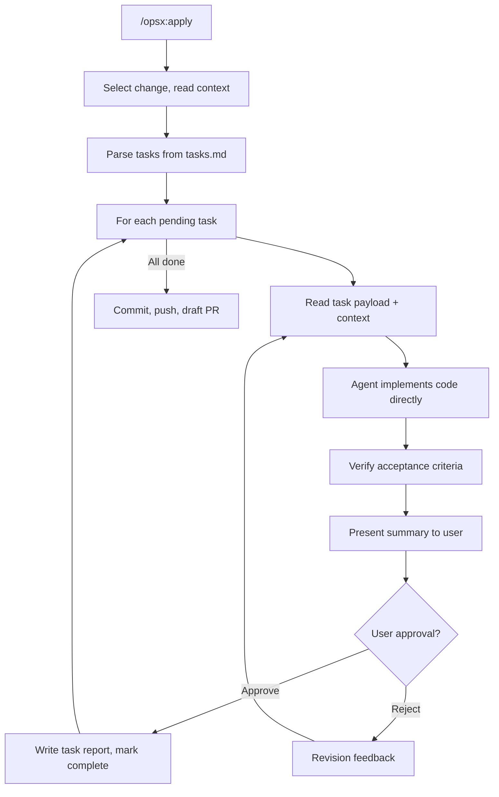

# Remove OAPE Command Orchestration and Eval Gate

## Summary

Remove the OAPE command routing system (external AI helper prompts) and the `code_generation_eval_gate` (which depends on OAPE commands). The Cursor agent reads context files + task payload and implements code directly in-session, one task at a time with user approval after each task.

## Key Changes

### 1. Schema: Remove `oape_routing`, `code_generation_eval_gate`, rewrite `apply:` block

**File:** [`openspec/schemas/openspec-agile-workflow/schema.yaml`](openspec/schemas/openspec-agile-workflow/schema.yaml)

- **Lines ~251-310**: Delete the entire `code_generation_eval_gate:` section
- **Lines ~555-704**: Delete the entire `oape_routing:` section
- **Lines ~1388-1434**: Rewrite the `apply:` stage block:
  - Remove `oape_routing: true`
  - Remove all eval gate references
  - Replace instruction with direct implementation guidance

New `apply:` block:

```yaml
apply:
  artifact: implementation
  requires:
    - tasks
    - specs
    - plan
  optional_context:
    - repo-assessment
    - constitution.md
    - AGENTS.md
  tracks: tasks.md
  instruction: |
    Read context files. Implement tasks one at a time in Linear Execution Order.
    Use agents.md for architecture patterns, test exemplars, and coding conventions.
    Use constitution.md for guardrails and verification requirements.
    After implementing each task, verify acceptance criteria, present changes,
    and ask for user approval.
    Mark task complete only after user approves. Pause if unclear or blocked.
```

### 2. Rewrite opsx-apply command

**File:** [`.cursor/commands/opsx-apply.md`](.cursor/commands/opsx-apply.md)

Strip all OAPE and eval gate orchestration. Keep:
- Select change, get status/instructions
- Read context files (constitution, agents.md, specs, plan, tasks)
- Task loop: implement directly, verify acceptance criteria, present for approval
- On approve: write task report, mark complete
- On reject: revision feedback, re-run task
- Post-loop: commit, push, draft PR

Remove:
- OAPE command resolution/dispatch
- Design bundle composition as formal OAPE input
- Code eval gate scoring/refinement passes
- All references to `.cursor/commands/api-generate.md` etc.

### 3. Simplify openspec-apply-change skill

**File:** [`.cursor/skills/openspec-apply-change/SKILL.md`](.cursor/skills/openspec-apply-change/SKILL.md)

- Remove "Allowed OAPE commands" list
- Remove "Run one OAPE command" step
- Remove code eval gate steps (scoring, refinement, scorecard)
- Replace with: "Implement task payload directly, verify acceptance criteria, present for user approval"

### 4. Delete OAPE command files

- [`.cursor/commands/api-generate.md`](.cursor/commands/api-generate.md)
- [`.cursor/commands/api-implement.md`](.cursor/commands/api-implement.md)
- [`.cursor/commands/api-generate-tests.md`](.cursor/commands/api-generate-tests.md)
- [`.cursor/commands/e2e-generate.md`](.cursor/commands/e2e-generate.md)

### 5. Delete eval gate files

- [`openspec/schemas/openspec-agile-workflow/evals/code-generation_eval.yaml`](openspec/schemas/openspec-agile-workflow/evals/code-generation_eval.yaml)
- [`openspec/schemas/openspec-agile-workflow/stage-gate/CODE_GENERATION_EVAL_PROMPT.md`](openspec/schemas/openspec-agile-workflow/stage-gate/CODE_GENERATION_EVAL_PROMPT.md)

### 6. Update code-generation-template.md

**File:** [`openspec/schemas/openspec-agile-workflow/templates/code-generation-template.md`](openspec/schemas/openspec-agile-workflow/templates/code-generation-template.md)

This was the "manual agent" fallback. It becomes the primary code generation guidance for all tasks:
- Remove OAPE command routing references
- Remove eval gate orchestration references
- Keep: mission, inputs, core rules, FILE OPERATIONS format, verification (acceptance criteria only)

### 7. Cleanup secondary references

Files with OAPE/eval-gate mentions to update:
- [`openspec/config.yaml`](openspec/config.yaml) — remove "OAPE" from implementation rules
- [`openspec/schemas/openspec-agile-workflow/templates/design-bundle-template.md`](openspec/schemas/openspec-agile-workflow/templates/design-bundle-template.md) — remove OAPE routing section
- [`openspec/schemas/openspec-agile-workflow/templates/implementation-report-template.md`](openspec/schemas/openspec-agile-workflow/templates/implementation-report-template.md) — remove "OAPE Commands Executed" and eval scorecard fields
- [`openspec/schemas/openspec-agile-workflow/templates/implementation-task-report-template.md`](openspec/schemas/openspec-agile-workflow/templates/implementation-task-report-template.md) — remove OAPE/eval fields
- [`openspec/inputs/agents.md`](openspec/inputs/agents.md) — remove OAPE command mapping
- [`README.md`](README.md) — update OAPE mentions
- [`eval-generation/`](eval-generation/) — review if code-generation eval spec references need updating

### 8. Keep (do not delete)

- `.cursor/commands/predict-regressions.md`, `review.md`, `implement-review-fixes.md`, `analyze-rfe.md`, `init.md` — utilities, not OAPE
- `.cursor/commands/opsx-new.md`, `opsx-continue.md`, `opsx-explore.md`, `opsx-archive.md` — workflow commands
- `openspec/schemas/openspec-agile-workflow/stage-gate/USER_FEEDBACK_PROMPT.md` — user feedback, not eval gate
- Other eval-generation pipeline files (unless they only serve the code-generation eval gate)

## Flow After Change


