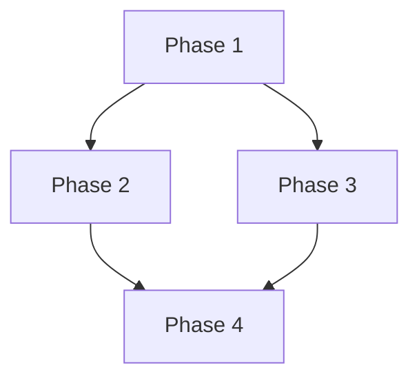

# Technical Implementation Plan

**Feature**: [FEATURE_SUMMARY]
**Date**: [DATE]
**Spec**: `specs/[CAPABILITY]/spec.md`
**Repo Assessment**: `repo-assessment.md`
**Constitution**: `constitution.md`

---

## 0. Inputs Acknowledged

| Input | Status |
|-------|--------|
| Spec source | [TICKET_ID or feature name from specs] |
| Repo assessment pin | [REPO_URL], branch [BRANCH], commit [COMMIT_SHA] (tooling_status: [FULL\|PARTIAL]) |
| Constitution | [PROVIDED / PLACEHOLDER — if placeholder, list provisional guardrails] |

---

## 1. Architectural Strategy

<!-- High-level approach constrained by constitution principles and repo assessment guardrails. -->

[STRATEGY_DESCRIPTION]

**Repo-grounded reality check**: [Cross-reference repo-assessment Key Finding — greenfield, delta/hardening, or mix?]

---

## 2. Persistence & State

<!-- State model from spec requirements and repo target files. -->
<!-- For stateless features, mark N/A with brief explanation. -->

| Object | Role | Source |
|--------|------|--------|
| [OBJECT] | [source-of-truth / derived / external] | [WHERE_DEFINED] |

---

## 3. Interfaces & Contracts

<!-- Only include applicable subsections. -->

### APIs

<!-- Endpoint definitions, request/response contracts. -->

### Controllers / Runtime

<!-- Reconciliation logic, event handling. -->

### Security / RBAC

<!-- Permissions, blast radius. -->

---

## 4. Dependencies & Sequencing Graph

<!-- Critical path, parallelizable streams, external dependencies. -->

---

## 5. Implementation Phases

### Phase 1: [PHASE_NAME]

- **Goal**: [WHAT_THIS_PHASE_ACHIEVES]
- **Dependencies**: [PREREQUISITE_PHASES_OR_NONE]
- **Target Files**: [FROM_REPO_ASSESSMENT_SECTION_1]
- **Verification Hooks**: [FROM_CONSTITUTION_OR_REPO_CONVENTIONS]

### Phase 2: [PHASE_NAME]

- **Goal**: [WHAT_THIS_PHASE_ACHIEVES]
- **Dependencies**: [PREREQUISITE_PHASES]
- **Target Files**: [FROM_REPO_ASSESSMENT]
- **Verification Hooks**: [TEST_OR_VALIDATION_APPROACH]

---

## 6. Verification Matrix

| Spec Criteria | Test Category | File/Suite Reference |
|---------------|---------------|---------------------|
| [FR-001 / SC-001] | [Unit / Integration / E2E / Manual] | [FILE_OR_SUITE] |

---

## 7. Risks, Migrations & Operational Follow-ups

<!-- From repo-assessment Section 5 + spec gaps + strained constitution principles. -->

| Risk | Description | Mitigation |
|------|-------------|------------|
| [RISK_NAME] | [DESCRIPTION] | [MITIGATION] |

---

## 8. Open Questions / SME Decisions

<!-- Decisions the plan cannot make alone. -->

| Question | Who Can Answer | Assumption If No Answer |
|----------|---------------|------------------------|
| [QUESTION] | [ROLE_OR_PERSON] | [DEFAULT_ASSUMPTION] |
