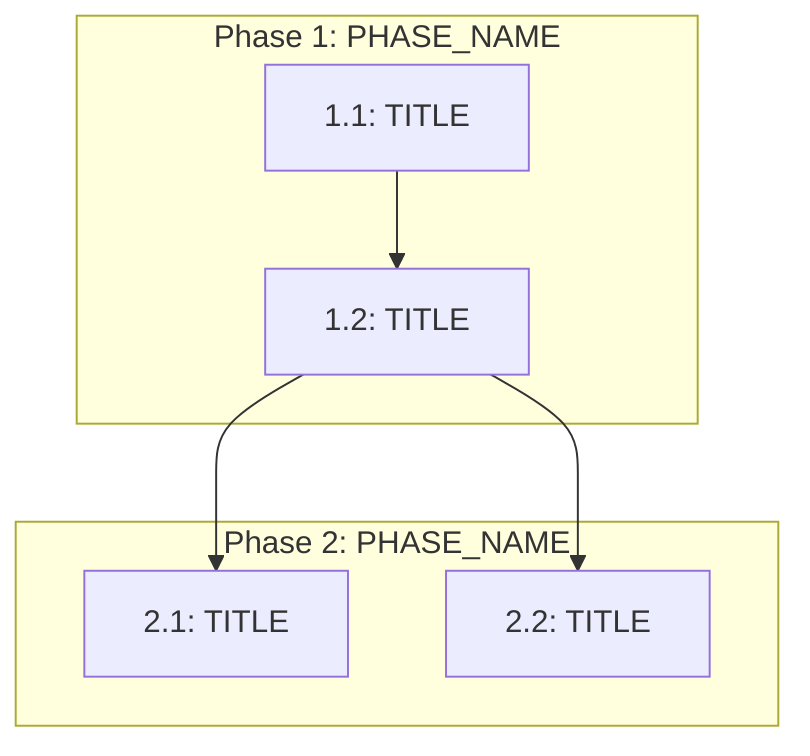

# Execution Backlog

**Feature**: [FEATURE_NAME]
**Constitution Version**: [CONSTITUTION_LABEL]

---

## 0. Input Coverage Checklist

<!-- Map every spec goal and plan phase to at least one task. Proves nothing was dropped. -->

| Spec/Plan Reference | Covered By |
|---------------------|-----------|
| [FR-001] | [T1.1, T1.2] |
| [SC-001] | [T2.1] |
| [Phase 1] | [T1.1, T1.2, T1.3] |

**Complexity scale**: Fibonacci — 1 (trivial), 2 (small), 3 (medium), 5 (large), 8 (extra-large, consider splitting).

---

## 1. Task Dependency Graph

---

## 2. Phase 1 — [PHASE_NAME]

- [ ] 1.1 [TASK_DESCRIPTION]
- [ ] 1.2 [TASK_DESCRIPTION]
- [ ] 1.3 [TASK_DESCRIPTION]

## 3. Phase 2 — [PHASE_NAME]

- [ ] 2.1 [TASK_DESCRIPTION]
- [ ] 2.2 [TASK_DESCRIPTION]

## 4. Phase 3 — [PHASE_NAME]

- [ ] 3.1 [TASK_DESCRIPTION]
- [ ] 3.2 [TASK_DESCRIPTION]

<!-- Add more phases as needed. Each task MUST be a checkbox for tracking. -->

---

## 5. Task Manifest

| Task ID | Task Title | Phase | Depends On | Parallel OK | Complexity | Risk |
|---------|-----------|-------|-----------|------------|-----------|------|
| 1.1 | [TITLE] | 1 | none | No | [1-8] | [Low/Med/High] |
| 1.2 | [TITLE] | 1 | 1.1 | No | [1-8] | [Low/Med/High] |
| 2.1 | [TITLE] | 2 | 1.2 | No | [1-8] | [Low/Med/High] |

---

## 6. Task Payloads

### Task 1.1: [TITLE]

- **Objective**: [WHAT_THIS_TASK_ACCOMPLISHES]
- **Target file(s)**: [FILE_PATHS_FROM_REPO_ASSESSMENT]
- **Non-goals / forbidden edits**: [WHAT_NOT_TO_TOUCH]
- **Implementation notes**: [NON_CODE_CONSTRAINTS_AND_PATTERNS]
- **Acceptance criteria**: [TRACES_TO_SPEC_IDS — e.g., FR-001, SC-002]
- **Downstream handoff**: [WHAT_NEXT_TASK_EXPECTS]

---

### Task 1.2: [TITLE]

- **Objective**: [WHAT_THIS_TASK_ACCOMPLISHES]
- **Target file(s)**: [FILE_PATHS]
- **Non-goals / forbidden edits**: [WHAT_NOT_TO_TOUCH]
- **Implementation notes**: [CONSTRAINTS_AND_PATTERNS]
- **Acceptance criteria**: [SPEC_IDS]
- **Downstream handoff**: [WHAT_NEXT_TASK_EXPECTS]

---

<!-- Add payload for every task -->

---

## 7. Orchestration Notes

### Retry Boundaries

- [WHAT_CAN_BE_SAFELY_RETRIED]

### Merge Conflict Hotspots

- [FILES_LIKELY_TO_CONFLICT_AND_MITIGATION]

### Open Questions Requiring SME Before Execution

- [OPEN_QUESTION]: blocks [TASK_IDS]
